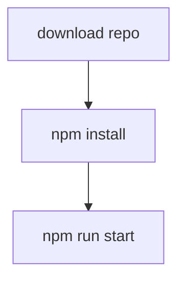

trying a mermaid graph

### Wordle Clone

### Deploy

- https://wordley-wordle-react.netlify.app/

### To Run in Dev

- `npm run start`

### To Run Lambda Functions in Dev

- `npm run lambda`
- http://localhost:9000/.netlify/functions/dictionary

### Project Kanban Board

- https://github.com/maiya-22/wordle-clone-react/projects/1?add_cards_query=is%3Aopen
