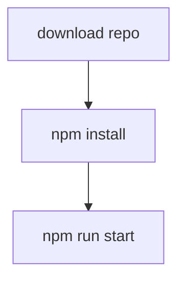

# Wordle Clone

### (If you happen upon this repo and want to contribute, please feel free to make a pull request. mid.june.light@gmail.com for any info).

## Deployed Site:

- https://wordley-wordle-react.netlify.app/

## Project Kanban Board:

- https://github.com/maiya-22/wordle-clone-react/projects/1?add_cards_query=is%3Aopen

### To Run in Dev:

---

## 

---
